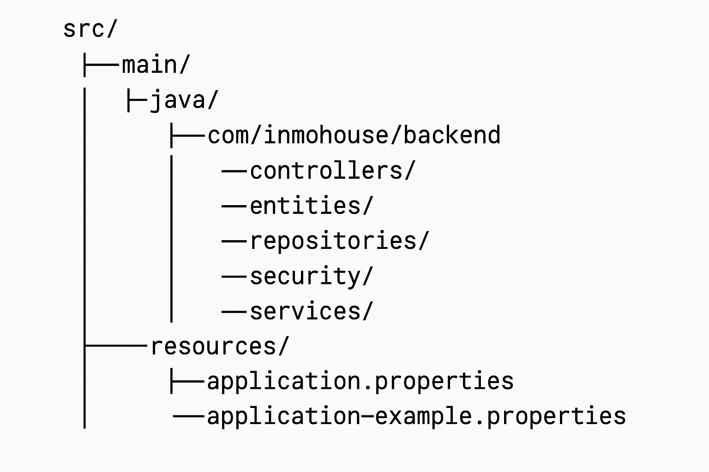

# 🏠 InmoHouse Backend

Aplicación backend para la gestión de usuarios y propiedades inmobiliarias. Desarrollado con Spring Boot, JWT, Spring Security y MySQL.

## 🚀 Tecnologías

- Java 17
- Spring Boot 3
- Spring Security 6
- JWT (JSON Web Token)
- MySQL
- Maven

## 🔐 Autenticación y autorización

- Endpoint de autenticación: `/api/auth/login`
- Devuelve un JWT firmado con clave secreta
- El token se debe incluir en cada petición protegida:
  Authorization: Bearer <token>
- Acceso restringido por rol (`ROLE_ADMIN`, `ROLE_AGENTE`, etc.)

## 🛠️ Seguridad con Spring Security

Se implementa `JwtAuthFilter` que:

- Intercepta las peticiones HTTP
- Extrae el token del header
- Valida el token y recupera el usuario desde la BD
- Convierte los roles en authorities (`ROLE_ADMIN`, etc.)
- Establece el contexto de autenticación

Los endpoints están protegidos con `@PreAuthorize("hasAuthority(...)")`.

## 🔐 Endpoints protegidos

| Endpoint            | Método | Rol requerido | Descripción                  |
|---------------------|--------|---------------|------------------------------|
| `/api/auth/login`   | POST   | Público       | Inicia sesión y devuelve JWT |
| `/api/users`        | GET    | ADMIN         | Lista todos los usuarios     |
| `/api/users/{id}`   | GET    | ADMIN         | Muestra un usuario por ID    |
| `/api/users`        | POST   | ADMIN         | Crea un nuevo usuario        |
| `/api/users/{id}`   | PUT    | ADMIN         | Actualiza usuario existente  |
| `/api/users/{id}`   | DELETE | ADMIN         | Elimina usuario              |

## 🧪 Ejemplo de uso con Postman

1. Realiza login:

   POST http://localhost:8080/api/auth/login

   Body:
   {
     "email": "oscar@mail.com",
     "password": "12345"
   }

2. Copia el JWT del response

3. En las peticiones siguientes, agrega:

   Authorization: Bearer <el-token>

## ⚙️ Configuración

1. Duplica el archivo de configuración de ejemplo:
   cp src/main/resources/application-example.properties src/main/resources/application.properties

2. Configura tus propiedades:

   jwt.secret=tu-clave-secreta
   jwt.expiration=86400000
   spring.datasource.url=jdbc:mysql://localhost:3306/inmohouse
   spring.datasource.username=tu_usuario
   spring.datasource.password=tu_contraseña

## 🧠 Cómo funciona la seguridad

- El filtro JwtAuthFilter valida el JWT en cada request
- Si es válido, carga el usuario y roles
- Se configuran las authorities en el contexto de Spring
- Los métodos protegidos validan el rol con `@PreAuthorize`
- Si el rol no es suficiente, devuelve 403 Forbidden

## 📁 Estructura del proyecto

## ✅ Recomendaciones

- Usa `hasAuthority(...)` en vez de `hasRole(...)`
- Encripta contraseñas con BCrypt
- Mantén el secret JWT fuera del repositorio
- Crea tokens con expiración limitada
- Usa `application-example.properties` como referencia

## 👨‍💻 Autor

Oscar Pérez  
Con arquitectura limpia, modular y buenas prácticas aplicadas.

